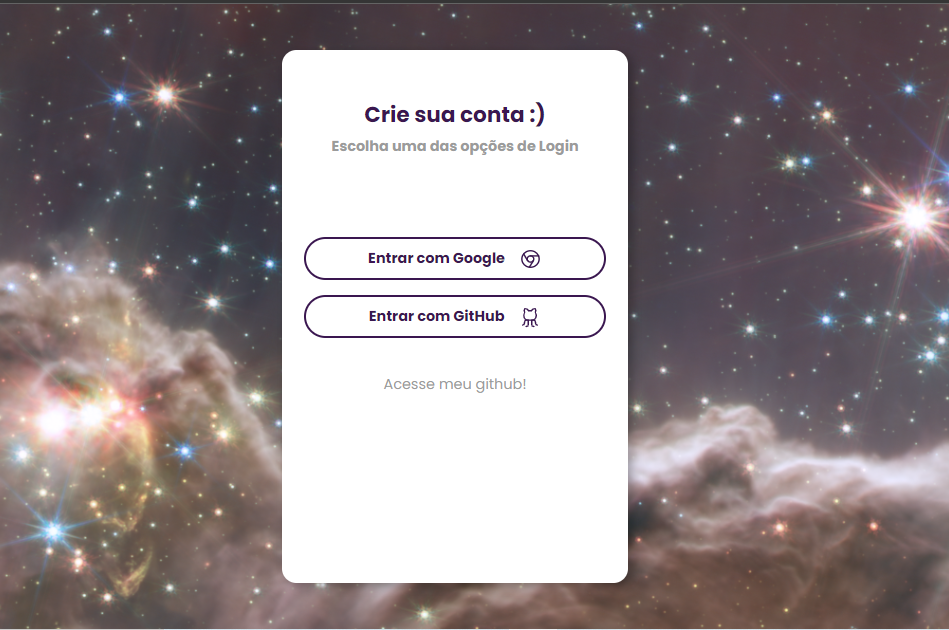

## Inicialização

Para iniciar o projeto, é necessário realizar o download de todas as dependências utilizadas pela aplicação com: 

```bash
yarn add
```
Para iniciaizar a aplicação no modo desenvolvedor:

```bash
yarn dev
```
O resultado pode ser visualizado em [http://localhost:3000](http://localhost:3000). 


## AuthApp

Aplicação criada com Next.js que implementa autenticação com GitHub e Google para acesso à rota './pages/logged.tsx' afim de ratificar os conhecimentos adiquiridos acerca da solução. A estrutura base do projeto foi inicializada através do [Vite]((https://vitejs.dev/)).

A página inicial apresenta as opções de Login implementadas e um link para o meu GitHub:



Após a autenticação, a aplicação encaminha o usuário para uma outra página, que apresentam a foto do usuário, nome e email de cadastro:


## OBS -> Configuração e redirect URI padrão GOOGLE
https://next-auth.js.org/providers/google

